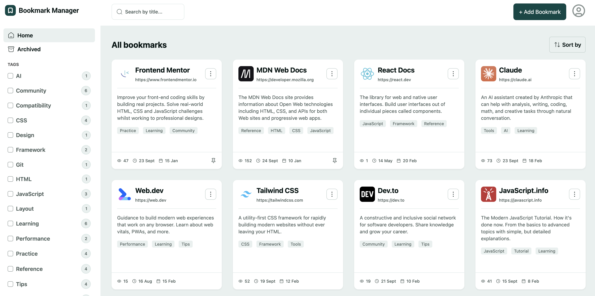

# Frontend Mentor - Bookmark manager app solution

This is a solution to the [Bookmark manager app challenge on Frontend Mentor](https://www.frontendmentor.io/challenges/bookmark-manager-app). Frontend Mentor challenges help you improve your coding skills by building realistic projects. 

## Table of contents

- [Overview](#overview)
  - [The challenge](#the-challenge)
  - [Screenshot](#screenshot)
  - [Links](#links)
- [My process](#my-process)
  - [Built with](#built-with)
  - [What I learned](#what-i-learned)
  - [Continued development](#continued-development)
  - [Useful resources](#useful-resources)
- [Author](#author)

## Overview

The Bookmarks app is built as a full stack app. The user is able to:

- SignUp and create a new account
- Login using their email and password
- Default bookmarks has been added for all users for the sake of the challenge
- Add new bookmarks with a title, description, website URL, and tags
- View all their bookmarks
- See bookmark details including favicon, title, URL, description, tags, view count, last visited date, and date added
- Search for bookmarks by title in the search bar
- Filter bookmarks by selecting one or multiple tags from the sidebar
- Reset tag filters to view all bookmarks again
- View archived bookmarks
- Archive bookmarks to remove them from the main view without deleting them
- Pin/unpin bookmarks to keep important ones easily accessible
- Edit existing bookmarks to update their details
- Copy bookmark URLs to the clipboard
- Visit bookmarked websites directly from the app
- Sort bookmarks by "Recently added", "Recently visited", or "Most visited"
- Toggle between light and dark color themes
- View the optimal layout for the interface depending on their device's screen size
- See hover and focus states for all interactive elements on the page

### Screenshot

### Links

- Solution URL: [Solution Url](https://github.com/alsheha88/bookmark-manager)
- Live Site URL: [Add live site URL here](https://your-live-site-url.com)

## My process

### Built with

- Semantic HTML5 markup
- CSS custom properties
- Flexbox
- CSS Grid
- Mobile-first workflow
- [React](https://reactjs.org/) - JS library
- [TypeScript](https://www.typescriptlang.org/)
- [Tailwind CSS](https://tailwindcss.com/)
- [React Router](https://reactrouter.com/home)
- [React Hook Form](https://react-hook-form.com/)
- [Zod](https://zod.dev/)
- [TanStack Query](https://tanstack.com/query/latest)
- Node.js
- Express.js
- PostgreSQL
- Prisma ORM
- JWT Authentication
- bcrypt

### What I learned

This is the first Full Stack application I`ve built. I have learned a lot of things while developing this website such as:

- Building an API.
- PostgresSQL & Prisma ORM building and managing database.
- authentication and authentication middleware.
- React form validation using react form hook.
- Tanstack Query which made it super easy to fetch and cache data.
- Express and express middlewares.
- HTTP status codes.

and many more....

### Continued development

I have really enjoyed building a full stack application with all its challenges and would like to build more full stack applications to master authentication, database and building custom APIs. in addition to strengthening my REACT skills.

### Useful resources

- [TanStack Query](https://tanstack.com/query/latest)
- [REACT Router](https://reactrouter.com/home)
- [REACT Hook Form](https://react-hook-form.com/)

## Author

- Website - [GitHub](https://github.com/alsheha88)
- Frontend Mentor - [@alsheha88](https://www.frontendmentor.io/profile/alsheha88)

